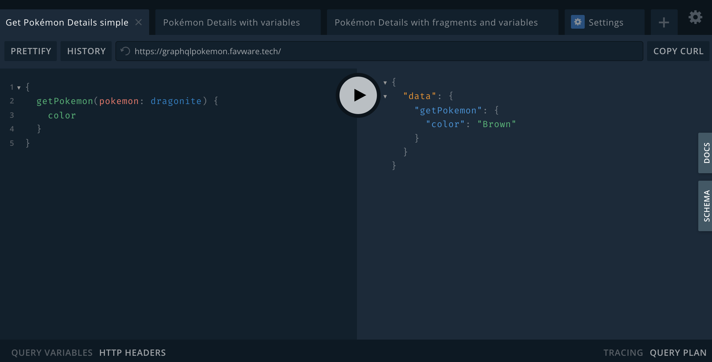

GraphQL is a query language developed by Facebook; It has become popular for retrieving data over HTTP from various backends/databases under a single API (or even databases directly). That is, data is accessible from potentially different sources under a single query language. There are libraries, for both server and client functions, in *many* languages, including Java, Python, C/C++, JavaScript, etc.

## Why GraphQL?
The main advantage of GraphQL is the ability for the client to decide what information is returned by a single query. This allows for less data to be sent from the API server. Additionally, this simplifies code on the client end since there will be less parsing of the returned data. GraohQL allows for cleaner code and bandwidth, which is a win-win!

## Querying for Data
Follow along with the examples by using the interactive query editor [GraphQL Pokemon](https://graphqlpokemon.favware.tech/), so you can try the queries yourself right in your browser.



### Basic Query
To retrieve data, we must write a ***query*** to define what data is needed. First, let's find the color of the pokemon, Machop. In the **DOCS** tab, we can see there is a `getPokemon` query that can take a pokemon's name (all values are listed in the **SCHEMA** tab under `PokemonEnum`) as an argument.  To retrieve Machop's color, simply query:

```
{
  getPokemon(pokemon: machop) {
    color
  }
}
```

Then, the following data is returned in the JSON format:
```json
{
  "data": {
    "getPokemon": {
      "color": "Gray",
    }
  }
}
```

Notice that though the  `Pokemon` object has over 20 fields, the response only contains the field that was queried for: `color`.

### Query with Nested Type
Now, let's try to find the color, type(s), pokedex-number, and evolutions of Charmander.

```
{
  getPokemon(pokemon: charmander) {
    color
    types
    num
    evolutions {
      species
    }
  }
}
```

After submitting the query, we get the following data back:
```json
{
  "data": {
    "getPokemon": {
      "color": "Red",
      "types": [
        "Fire"
      ],
      "num": 4,
      "evolutions": [
        {
          "species": "charmeleon"
        }
      ]
    }
  }
}
```

Unlike the previous query, this query contains a list of `types` (denoted by surrounding `[``]`), but more interestingly, `evolutions` contains a list of `Pokemon` objects inside of the object containing data for Charmander. Next, let's query for the species, color, type(s), and pokedex-number of *both* Charmander and its evolution, Charmeleon.

### Query with Fragments
Luckily, rather than duplicating all of the fields and bloating the query, can be used ***fragments*** to represent a set of fields to be queried. This is accomplished as follows:

```
{
  getPokemon(pokemon: charmander) {
    ...pokeData
    evolutions {
      ...pokeData
    }
  }
}

fragment pokeData on Pokemon {
  species
  color
  types
  num
}
```

The data returned is:
```json
{
  "data": {
    "getPokemon": {
      "species": "charmander",
      "color": "Red",
      "types": [
        "Fire"
      ],
      "num": 4,
      "evolutions": [
        {
          "species": "charmeleon",
          "color": "Red",
          "types": [
            "Fire"
          ],
          "num": 5
        }
      ]
    }
  }
}
```

Not only did this prevent duplicate fields on both the outer (`getPokemon`) and inner (`evolutions`) fields, making the query much simpler to read. Additional fields can be queried in addition to the ***fragments***, notice how `evolutions` is can still be queried alongside `pokeData`. 

## Conclusion
GraphQL gives a lot of power to the client/end-user, making it a pleasure to work with. To explore more publicly accessible GraphQL APIs, check out [this GitHub repo](https://github.com/APIs-guru/graphql-apis). You can also find more info on GraphQL, including the ability to modify data on the backend via ***mutations***, in [GraphQL's excellent documentation](https://graphql.org/learn/) which is also interactive!
