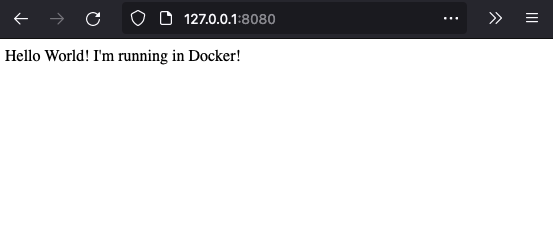

Containers, which may be well past their prime as the "hottest new technology", still have a strong use case in the development and delivery of software. 

A container wraps up all of the software needed to run an application into a single "runtime". This includes the application itself, and all of the dependencies wrapped up in a developer-defined environment. Any given container will run the same on all hardware and operating systems, as long as the container platform is installed. In this post, you will build a simple Docker container that will host a *very* basic website!

## Pre-Requisites
Make sure you have docker installed on your system, you can find it here: 
https://docs.docker.com/get-docker/

After the installation completes, run Docker Desktop. You will also need a text editor of your choice. Notepad or TextEdit will work fine!

## Application
The application itself is incredibly simple. It will display the message **"Hello World! I'm running in Docker!"** when visited with a web browser.

First, create a new folder to contain all project files, I'm using `~/code/node-hello-world`. All of the files you create must be in this same folder.
In your project folder, create a new file called `app.js` and paste the following code.
```js
var express = require('express');
var app = express();app.get('/', function (req, res) {
  res.send('Hello World! I\'m running in Docker!');
});app.listen(8080, function () {
  console.log('Example app listening on port 8080!');
});
```
This code will simply launch a web server (called Express) and send a message to clients who connect.

Next, create another new file called `package.json` with the following content. This file is required for Node, and allows the dependencies to be pulled via npm (node package manager).
```json
{
  "name": "node-hello-world",
  "version": "1.0.0",
  "description": "",
  "main": "app.js",
  "scripts": {
    "start": "node app.js"
  },
  "author": "",
  "license": "ISC",
  "dependencies": {
    "express": "^4.17.1"
  }
}
```

## Docker and Dockerfile
Now that the application files are present, let's build the container. Luckily, this process is pretty easy and only requires one more plaintext file! This plaintext file is called the `Dockerfile`. For this project, we will base this container on the official `Node` image which simplifies the build process.

In your project folder, create a new file named `Dockerfile` (**Note:** there is no file extension) with the following contents:
```docker
FROM node:17

WORKDIR /srv/app
COPY . .
RUN npm install
EXPOSE 8080
CMD [ "node", "app.js" ]
```

This short file specifies the base image (with a version tag) of the container, copy the application files, and instruct the container on how to run the application when started. Almost there!

## Building & Running the Container
The container is essentially just one large archive, much like a `.zip` file. The means we need to apply our changes on top of the base image.
To do this, the `Dockerfile` will be used to build a brand new container. In the terminal of your choice, navigate to your project folder and run the following command (this may take a few minutes):
```bash
docker build . -t node-hello-world
```

Once that's complete, we can finally run the application! Enter the following command to start the container up (**Note:** this container will stay running in the background. See [here](#extra-docker-basics) to stop the container).
```bash
docker run -d -p 8080:8080 --name node-hello-world node-hello-world
```

Now, in your web browser, go to `http://127.0.0.1:8080/`. If successful, you should see the following:



***Congratulations! You created and ran your first Node app in a Docker container!***

---

## Extra: Docker Basics

- List currently running containers (**Note:** press Ctrl-c to exit)
```bash
docker stats
```

- Stop the container. You can reference either the container ID or the name, as seen in the `stats` command above
```bash
docker stop node-hello-world
```
- Delete the container
```bash
docker rm node-hello-world
```

***OR*** 

Use the Docker Desktop app to manage your containers & images in a GUI!

## For More Docker
- https://docs.docker.com/get-started/
- https://docker-curriculum.com/
