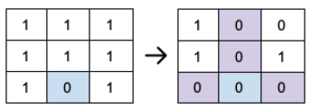
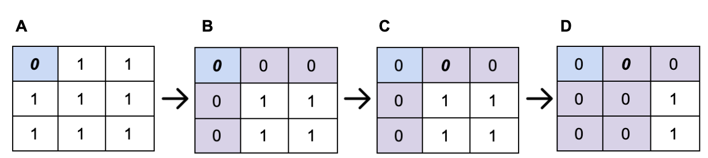

This problem, of **medium** difficulty, sounds trivial at first glance. However, given the constraints, it's not as straightforward as it initially appears. 

## The Problem
The problems is set-up as seen here: [Set Matrix Zeroes - LeetCode](https://leetcode.com/problems/set-matrix-zeroes/)

> Given an `m x n` integer matrix `matrix`, if an element is `0`, set its entire row and column to `0`'s, and return *the matrix*.
>
>You must do it [in place](https://en.wikipedia.org/wiki/In-place_algorithm).
>
> Constraints:
> * `m == matrix.length`
> * `n == matrix[0].length`
> * `1 <= m, n <= 200`
> * `2^31 <= matrix[i][j] <= 2^31 - 1`

We will be discussing the optimal solution, which has an additional constraint: space must be `O(1)`, also known as constant-space. This means we cannot create a copy of the matrix or use any other data structures which depend on `m` and/or `n` (e.g. arrays, lists, maps).

The following image depicts the expected output of the algorithm, following the order *input -> output*. We can see the only `0` in the input on the input is in the intersection of the third row from the top (index: `2`) and the 2nd column from the left (index: `1`). We will represent this position as the tuple, `(2,1)`.

By the constraints given, we can note the input cannot be empty (furthermore, it must be *at least* `1 x 0`. That is, one row and zero columns, per a [row-major](https://en.wikipedia.org/wiki/Row-_and_column-major_order) representation). We can also see that each element in the matrix is a typical **signed 4-byte integer**. While there is no constraint on the run-time of this algorithm, it is given that the algorithm must modify the matrix in place. Additionally, with the constant-space requirement, we cannot make a copy of the matrix to preserve all values in the original matrix.

## Considerations
The fact that we modify the only "source of truth," means we must tread carefully as we build output. Your first intuition may be to simply traverse the matrix, and set columns and rows to zero as a `0` element is encountered. However, if we modify the input before finding all positions, we may read a "new" `0` element which is a `1` in the input. We will illustrate this concern in the diagram below:

If we modify the matrix during the first iteration, it is possible to modify elements not yet visited. In the matrix labeled **C**, the next element at `(0,1)` is now 0, per applying the set-zero rule on the index `(0,0)`. However, the algorithm will now apply the set-zeros rule to the index `(0,1)` as seen in matrix **D**. Recall from the input, **A**, that there was no `0` element on the second column *or* the second row. The resulting matrix is not correct, even though the expected output is the intermediary matrix, **B**.

## Intuition
To avoid the issue described above, we must complete the first read before modifying the input. This requires creating some record(s) of the rows and columns to be overwritten with zeros. However, keeping in mind the constant-space requirement, this record must be contained *inside* the matrix itself and/or some constant number of variables (i.e. not bound by `m` or `n`). No additional data structures can be created. 

Some hints to help reach the solution:
- Is there a particular row/column which can be used to hold flags?
- Does this selection vary depending on if you iterate through the matrix by rows or columns?
- Are there special cases to applying the set-zero rule to this row/column holding the flags?

## Wrapping-Up
In part two we will complete the intuition, go over the algorithm (in C++), and discuss overall run-time/correctness. Try to build on some of the intuition shared in this post and find a solution of your own. Otherwise, catch the solution next week!
