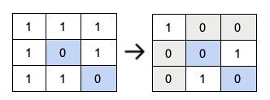
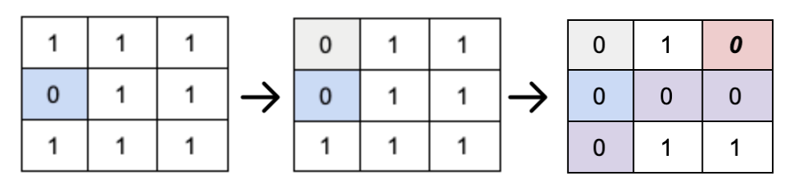

Continuing where we left off last week, let's finally dicuss the optimal solution to the [Set Matrix Zeroes](https://leetcode.com/problems/set-matrix-zeroes/) problem from LeetCode. If you have not read [Part 1](/2021/11/leetcode-set-matrix-zeroes-part-1/), please do so! In the previous post, we discussed the problem & constraints, as well as some intuition behind the solution. Using what we now know, let's go over the algorithm!

## The Solution
Recalling our constant-space requirement, and the issues that can come from writing zeroes before completing the first read, how can we safely indicate which rows and columns will be set to zero without compromising correctness? As hinted in the last post, we can store flags within in the input matrix itself! Specifically, in the `0`'th column and `0`'th row.

To set these flags, we must simply iterate through the matrix, and for every zero that is encountered, write zero as a flag in the `0` position of the corresponding column and row. That is, if we find a zero at some index, `(i, j)`, we will write a zero at `matrix[i][0]` *and* `matrix[0][j]`. The image below shows these flags written on an input. We expect this to be safe since, per the set-zeroes rule, this element will be zero in the final solution! But is it *really* safe? Let's find out as we write the zeroes.



Now that we know where zeroes need to be filled, all that is left is to fill zeroes for each zero flag found in the `0`'th column and row. That is, if we iterate through the matrix, and for some element `(i,j)` find a zero flag at `matrix[i][0]` *or* `matrix[0][j]`, write a zero at that element. However, similar to the issue discussed last week, it is possible to overwrite these flags and have an incorrect matrix as a result. To preserve these flags, we will simply write to the row and column containint the flags last! One elegant way to do this is to traverse the matrix backward. However, consider the following matrix and as zeroes are being filled:



Looking at the element shaded red, at position `(0,2)`, a zero has been incorrectly placed. There is no zero in the corresponding row or column defining this element. What went wrong? Since there was a zero in the first row, specifically at `(1,0)`, when we set the flag in this column, it's written at `(0,0)`. This seems fine until we iterate through the first row. The flag at the `(0,0)` position pertains only to the column, not the row. So, as zeroes are filled, the flag incorrectly indicates that the first row must also be overwritten with zeroes. This is **incorrect**. But how can we fix it?

Instead of writing a flag in the matrix if the first column must be overwritten, a single boolean can be used. That is, we will not write a zero at `(0,0)`, but instead set a bool `col_fill = true`. As a result, we will check this bool value when setting zeroes for the column, rather than the element `(0,0)`. That element can now be used safely as a flag for **just** the first row.

And that's it. If you've followed along this far, congratulations! You now have all of the pieces needed to write the algorithm meeting the constraints given.

## Algorithm (C++)
```c++
class Solution {
public:
  void setZeroes(vector<vector<int>> &matrix) {
    bool col_fill = false;

    // if a zero is found, write a zero to the first element in the 
    // corresponding row and column. A zero will act as a flag indicating
    // where zeroes will be filled.
    for (int i = 0; i < matrix.size(); i++) {
      // case: first column holding flags will be overwritten
      if (!col_fill && matrix[i][0] == 0) {
        col_fill = true;
      }

      for (int j = 1; j < matrix[0].size(); j++) {
        if (matrix[i][j] == 0) {
          matrix[0][j] = 0;
          matrix[i][0] = 0;
        }
      }
    }

    // Fill the zeroes the zeroes in place.
    // Handle case where the first colum will be over written,
    // traversing the matrix backwards to preserve flags in first row.
    for (int i = matrix.size() - 1; i > -1; i--) {
      for (int j = matrix[0].size() - 1; j > 0; j--) {
        if (matrix[0][j] == 0 || matrix[i][0] == 0) {
          matrix[i][j] = 0;
        }
      }

      if (col_fill) {
        matrix[i][0] = 0;
      }
    }
  }
};
```

## Run-time & Correctness
Since we have to read **all** of the elements at least once to discover which elements are zero, we can have no fewer than `m * n` operations. Note that only two traversals of the matrix were required for this solution: one to read the zeroes and one to write the zeroes. Therefore, the runtime is O(n * n).

Additionally, since we only declare a single variable in the algorithm, it must be the case that the space complexity is constant, i.e. O(1).

Suppose an element is zero at some index `(i,j)` on a matrix `M`, but the algorithm does not correctly fill zeroes on the corresponding row and column. That is, there was a flag set to zero on `M[i][0]` *or* `M[0][j]` (or `col_fill` was true if `j = 0`), but some zero was not filled based on this flag. We note that each flag corresponds to either one row or one column, after resolving the conflict of the flag found at the index `(0,0)`, as shown [above](#the-solution). The value of these flags will be zero if and only if it's zero in the input or by the set-zeroes rule, and will be set for every zero found in the input. However, since **every** element in the input checks **both** flags when settings zeroes, it must be the case all elements on the `i`'th column and `j`'th row are zero. Therefore, by contradiction, the algorithm must be correct.

## Conclusion
My experience with both finding the optimal solution and completing this write-up has reminded me that algorithms are difficult to create. It's okay if you don't find a similar solution on your first try (or even a working solution at all), I surely didn't. Like most things in life, problem-solving takes practice, and that's exactly why platforms like [HackerRank](https://www.hackerrank.com/) and [LeetCode](https://leetcode.com/) exist. Working through this solution has shown me not only how far I've come since my first year as a CS undergrad, but how much more I still have to learn. Feel free to reach out with any suggestions and/or corrections via the contacts on the [landing page](/). Thanks for reading!