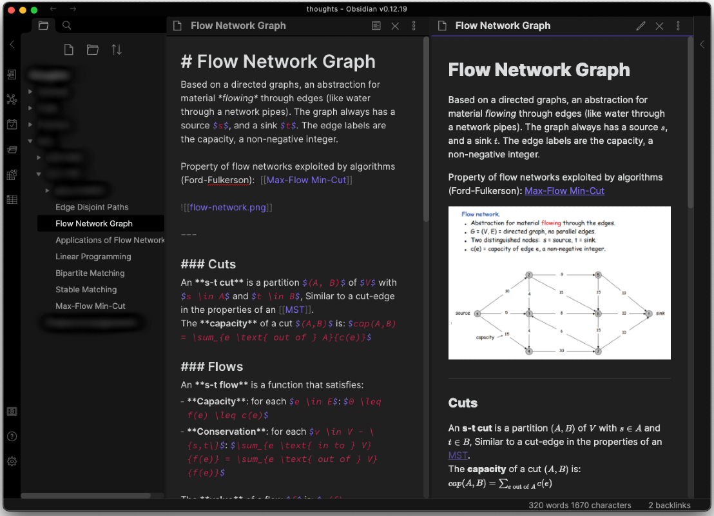
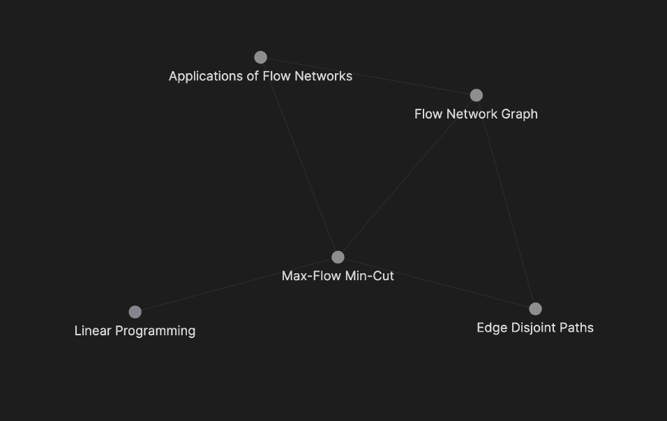

# Obsibian: Smart Plaintext Notes


[Obsidian](https://obsidian.md/) is a modern cross-platform note-taking application. By adapting my note-taking habits to fit the strengths of Obsidian, my notes have become more meaningful in content and reviewability. Those familiar with Notion and similar note-taking applications will feel right at home, but what makes Obsidian different?



## Features:

### Backlinking
* The star of the show: linking notes to build connections. It sounds pretty inconsequential, but it is great for helping structure your notes in more meaningful ways improving the value of your notes.
* Forming connections between notes also makes reviewing/studying notes much easier. By focusing on **ideas** as the topic of a single note instead of **Lecture XX - Jan 01**, the notes truly become yours. You can easily reorder, and expand or split notes to form new connections to cement your understanding. 
* The syntax is as simple as ```[[Title of Note to Link]]```, and you even get a cool graph: 

### Local first
* You own your data by default. Syncing can be easily done through various 3rd party hosting platforms such as OneDrive, Dropbox, Google Drive—or through a premium Obsidian subscription. 
* Even if Obsidian disappears from the face of the earth, your notes are safe on your local drive and can easily be migrated to another service. Please follow standard backup practices.

### Plaintext
* Markdown means your notes are stored in plaintext, readable anywhere, and can even be tracked by version control, such as [git + GitHub](https://github.com/). 
* LaTeX support and basic syntax highlighting is built-in.
* A more user-friendly WYSIWYG editor (live preview) is currently being developed, for those who don't know or particularly enjoy writing exclusively in markdown.

### Plugin Ecosystem
* Unlike other note-taking platforms, Obsidian has a rich community plugin ecosystem.
* Plugins can do anything from implementing new functionality to modifying the user interface. Nothing is off the table.

* Some of my favorite plugins: 
    - Calendar: a simple calendar view that links to daily, weekly, and monthly notes. Great for quick notes and journaling.
    - Kanban: a [kanban](https://kanbanize.com/kanban-resources/getting-started/what-is-kanban) scheduling/task-board
    - Advanced Tables: makes tables in markdown more pleasant to create and modify.

## Conclusion
If you take notes digitally, this application is a must-have. The longer you use it, the greater the return is. Best of all, you never have to worry about lock-in since your notes will always be available in the most basic form: plaintext. It's free to try, and if you end up enjoying it as much as I have, consider [supporting development](https://obsidian.md/pricing) .