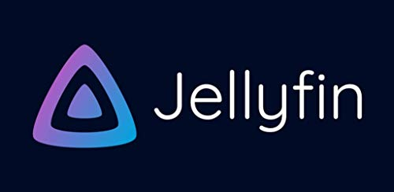
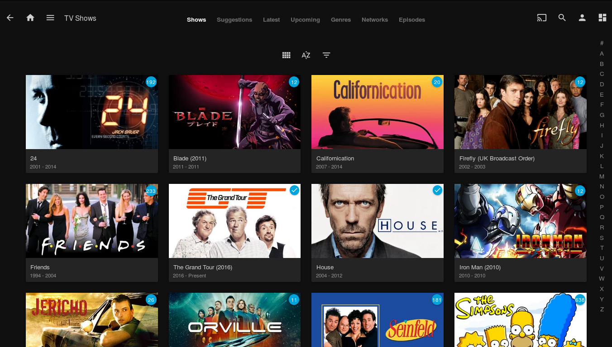

Open-source projects are plentiful, so I decided to highlight a few standouts which deserve some extra love. Well... all of them deserve extra love, but I'd like to highlight a few of my (100% biased) favorites. First up is a self-hosted media server I've had the pleasure of using for several years, now -- [Jellyfin](https://jellyfin.org/).

## What is Jellyfin
Jellyfin allows you to host the TV Series/Films/Music you own on a single server, and access this media from any device either through a web browser or client. It is essentially your own personal Netflix, handling some technical details behind the scenes (like automatically fetching metadata and ensuring media is compatible with all clients) so you can focus on just enjoying your media.

This project is based on Emby, forked from the last open-source release after Emby decided to [change their licensing and go closed-source](http://web.archive.org/web/20181212104719/https://github.com/MediaBrowser/Emby/issues/3479). The goal of Jellyfin is to provide the premier open-source media server experience, similar to Emby and Plex, but without requiring a paid license to access all features.

## Running Jellyfin
Depending on the hardware you wish to run Jellyfin on, the installation process will be different. Luckily, there is a guide available that can quickly get you going. If you prefer to follow along with a video, there are many tutorials available on YouTube, as well.

* [Official Quick Start Guide](https://jellyfin.org/docs/general/quick-start.html)

## How to Contribute
The greatest part of open source software is that *you* have the freedom to implement the features *you* want to see in the final product. Of course, not everyone is a developer, but anyone can contribute! From suggesting new features and reporting bugs, to creating art and translating the interface, everyone is free to contribute to the project! All source code is available on GitHub: 
* Server - [jellyfin/jellyfin](https://github.com/jellyfin/jellyfin)
* Web Client (Official) - [jellyfin/jellyfin-web](https://github.com/jellyfin/jellyfin-web)
* Android TV - [jellyfin/jellyfin-androidtv](https://github.com/jellyfin/jellyfin-androidtv)
* iOS/tvOS (Official) - [jellyfin/Swiftfin](https://github.com/jellyfin/Swiftfin)

Additionally, you can read the [contributors guide](https://jellyfin.org/docs/general/contributing/index.html) to get started. If you have never contributed to a project before, the Jellyfin team would love to help you with your first pull request (PR). Most of the official repos feature a `good first issue` label to help you get started with your first contribution. The team helped me with [my first PR](https://github.com/jellyfin/jellyfin-web/pull/439), and I can promise your time/effort will be appreciated, no matter how simple you believe your contribution maybe!
